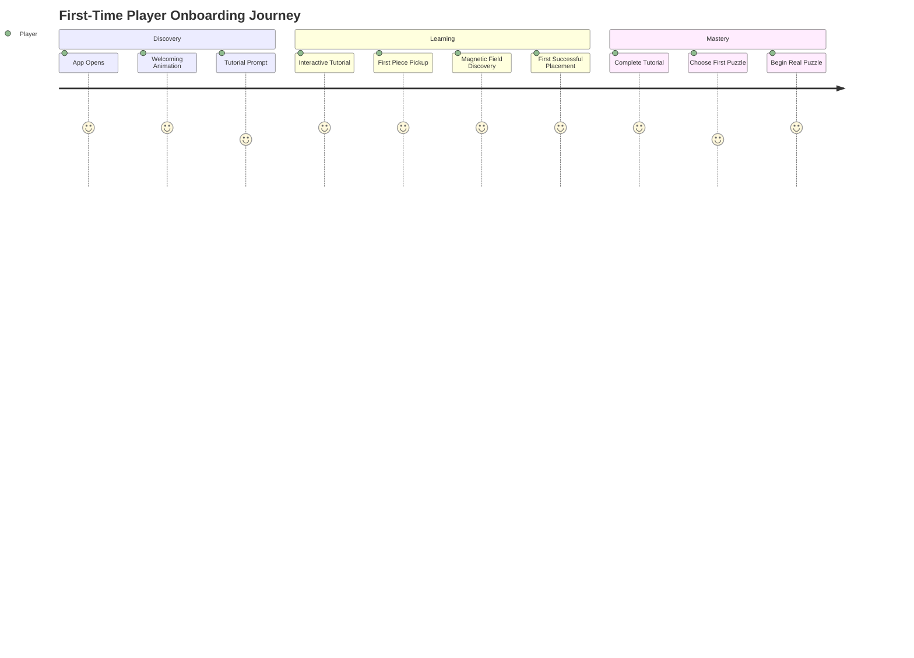
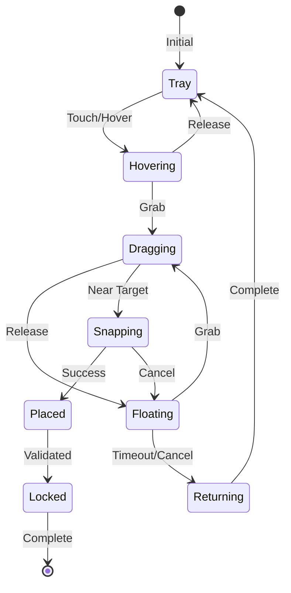

# Puzzle Nook User Experience Storyboards
## Comprehensive Interaction Design Documentation

*Version 1.0 - Interaction Model Specification*

---

## 1. User Journey Maps

### 1.1 First-Time Player Experience



**Detailed Steps:**

```yaml
Step 1 - Welcome (0-3 seconds):
  Visual:
    - Gentle fade-in of logo
    - Pieces floating in background with magnetic field visualization
    - Soft glow emanating from center
  Haptic:
    - Gentle heartbeat pattern (thump-thump... thump-thump)
  Audio:
    - Soft ambient music fade-in
    - Subtle magnetic hum
  Rationale:
    - Creates calm, inviting atmosphere
    - Introduces magnetic field concept immediately

Step 2 - Interactive Tutorial (3-30 seconds):
  Visual:
    - Single piece glows and pulses
    - Magnetic field lines become visible
    - Ghost preview shows target location
  Interaction:
    - "Touch the glowing piece" prompt
    - Piece responds with stronger glow and gentle lift animation
    - Drag gesture tutorial with trailing particles
  Haptic:
    - Light tap on first touch
    - Continuous gentle vibration during drag
    - Strong satisfying click on placement
  Audio:
    - Rising tone on pickup
    - Sustained note during drag
    - Musical chord on successful placement
  Rationale:
    - Teaches core mechanics without text
    - Rewards every correct action immediately

Step 3 - Magnetic Field Introduction (30-45 seconds):
  Visual:
    - Field lines pulse from piece toward target
    - Attraction strength visualized through line brightness
    - Near-miss shows red pulse, then guides to correct spot
  Interaction:
    - Player deliberately tries near-miss placement
    - Piece gently repels, then shows correct location
    - Magnetic pull increases as piece approaches target
  Haptic:
    - Increasing pulse frequency as approaching correct position
    - Resistance feedback for wrong placement
    - Magnetic "pull" sensation near target
  Rationale:
    - Makes invisible forces visible and understandable
    - Teaches that the puzzle helps you succeed

Step 4 - First Real Puzzle (45+ seconds):
  Visual:
    - Full puzzle appears with subtle animation
    - Edge pieces subtly highlight
    - Tray organizes itself automatically
  Choices:
    - Difficulty selection through visual metaphor (2, 4, 9 pieces)
    - Theme selection (nature, abstract, animals)
  Rationale:
    - Immediate sense of agency
    - No overwhelming options
```

### 1.2 Piece Selection from Tray

```yaml
Journey: Selecting a Piece from Tray

Trigger:
  - User taps/touches tray area
  - OR hovers finger over tray

Stage 1 - Tray Activation (0-100ms):
  Visual:
    - Tray pieces slightly separate for clarity
    - Subtle depth-of-field effect on workspace
    - Pieces gently rise (levitation effect)
  Haptic:
    - Micro-vibration (5ms) confirming tray focus
  Audio:
    - Soft "whoosh" of pieces spreading
  Physics:
    - Pieces apply separation force to prevent overlap
    - Spring physics for smooth spread animation

Stage 2 - Piece Hover (100-500ms):
  Visual:
    - Hovered piece grows 10% with spring animation
    - Magnetic field emanates from piece
    - Similar pieces subtly glow (AI suggestion)
    - Shadow grows beneath piece
  Haptic:
    - Light continuous vibration (20Hz)
  Audio:
    - Subtle crystalline "ping"
  Interaction:
    - Finger movement causes pieces to part like water
    - Magnetic cursor effect

Stage 3 - Piece Selection (500ms+):
  Visual:
    - Selected piece lifts 20px above tray
    - Bright glow surrounds piece
    - Other pieces fade 30% opacity
    - Potential placement zones highlight on board
  Haptic:
    - Medium impact (50ms)
  Audio:
    - Musical note based on piece color/position
  State Change:
    - Piece enters FLOATING state
    - Workspace prepares for placement

Rationale:
  - Progressive disclosure prevents overwhelming users
  - Each stage provides clear feedback
  - Similar piece highlighting reduces cognitive load
```

### 1.3 Piece Manipulation in Workspace

```yaml
Journey: Manipulating Piece in Workspace

Initial State:
  - Piece in FLOATING state
  - User has control but piece has subtle autonomous movement

Manipulation Phase 1 - Free Movement:
  Visual:
    - Piece follows finger with spring physics
    - Subtle particle trail indicates movement speed
    - Magnetic field lines show influence zones
    - Dynamic shadow based on "height" above board
  Haptic:
    - Variable vibration based on movement speed
    - Texture feedback when crossing other pieces
  Physics:
    - Momentum preservation on quick movements
    - Friction simulation for precise control
  Gestures:
    - Single finger: translate
    - Two fingers: rotate and scale
    - Double tap: auto-rotate 90°

Manipulation Phase 2 - Near Target Detection:
  Visual:
    - Target zone begins glowing
    - Magnetic field lines strengthen and animate
    - Piece slightly vibrates with anticipation
    - Ghost preview appears at target
  Haptic:
    - Pulsing pattern increases with proximity
    - Directional haptics guide toward target
  Audio:
    - Rising harmonic tone
    - Spatial audio indicates direction
  Physics:
    - Magnetic attraction force increases
    - Piece begins auto-rotating toward correct orientation

Manipulation Phase 3 - Precision Mode:
  Trigger:
    - Long press while near target
    - OR pinch gesture for zoom
  Visual:
    - Smooth zoom to 150% scale
    - Grid overlay appears for precision
    - Piece edges highlight for exact alignment
    - Micro-movements amplified visually
  Haptic:
    - High-frequency micro-feedback
    - Notched feeling for grid alignment
  Controls:
    - Reduced movement sensitivity
    - Fine-grain rotation (1° increments)
    - Tap to toggle between positions

Rationale:
  - Multiple manipulation modes for different skill levels
  - Progressive assistance without taking control
  - Precision mode for perfectionist players
```

### 1.4 Near-Miss Placement Attempts

```yaml
Journey: Near-Miss Placement Recovery

Trigger:
  - User attempts placement >5px but <30px from correct position

Stage 1 - Rejection Animation (0-200ms):
  Visual:
    - Piece briefly flashes red at edges
    - Repulsion effect pushes piece back
    - Correct position pulses green
    - Arrow or field lines point to correct spot
  Haptic:
    - Sharp double-tap (error pattern)
    - Followed by gentle pulling sensation
  Audio:
    - Soft "bonk" sound (non-punishing)
    - Followed by guidance chime
  Physics:
    - Gentle repulsion force
    - Piece bounces back with dampened spring

Stage 2 - Guidance Phase (200-1000ms):
  Visual:
    - Translucent overlay shows correct position
    - Magnetic field lines strengthen
    - Path animation from current to correct position
    - Distance indicator (optional for learning mode)
  Haptic:
    - Rhythmic pulsing toward correct position
    - Stronger pulses when moving correctly
  Audio:
    - Warmer tones as approaching correct position
    - Cooler tones when moving away
  Assistance:
    - After 3 attempts, increase magnetic attraction
    - After 5 attempts, show exact placement guide

Stage 3 - Learning Moment (optional):
  Trigger:
    - Multiple near-misses on same piece
  Visual:
    - Highlight matching edges/patterns
    - Show rotation hint if orientation is wrong
    - Briefly show completed image section
  Tutorial:
    - "Try rotating the piece" hint
    - "Look for matching colors" tip
  Adaptation:
    - System learns user's struggling patterns
    - Adjusts assistance for future similar pieces

Rationale:
  - Failure is reframed as learning opportunity
  - Progressive assistance prevents frustration
  - Never punishes, always guides
```

### 1.5 Successful Piece Placement

```yaml
Journey: Successful Piece Placement Celebration

Trigger:
  - Piece placed within 5px of correct position
  - Rotation within 5° of correct orientation

Stage 1 - Magnetic Snap (0-150ms):
  Visual:
    - Piece snaps with satisfying spring animation
    - Brief white flash at connection points
    - Neighboring pieces wiggle with excitement
    - Perfect alignment auto-correction
  Haptic:
    - Strong satisfying click (100ms, high intensity)
    - Secondary micro-vibrations (simulation of settling)
  Audio:
    - Satisfying "click" or "snap" sound
    - Musical note in puzzle's key signature
  Physics:
    - Magnetic snap with overshoot and settle
    - Connected pieces bond together

Stage 2 - Celebration Effects (150-500ms):
  Visual:
    - Ripple effect emanates from placement point
    - Particle burst (stars, sparkles) from edges
    - Brief glow spreads through connected pieces
    - Progress bar smoothly increments
  Haptic:
    - Fading vibration pattern (success echo)
  Audio:
    - Harmonic chord progression
    - Volume based on combo/streak
  Rewards:
    - Score increment with easing animation
    - Streak counter if applicable
    - Experience points for player profile

Stage 3 - Board Reorganization (500-1000ms):
  Visual:
    - Connected piece groups consolidate
    - Completed sections fade to background layer
    - Remaining pieces subtly reorganize in tray
    - AI highlights next suggested pieces
  Physics:
    - Completed sections become single rigid body
    - Reduces computational overhead
    - Maintains interactive feel

Special Cases:
  - Multi-piece completion: Enhanced effects
  - Edge/corner completion: Unique celebration
  - Pattern completion: Pattern-specific animation
  - Speed bonus: Lightning effect for quick placements

Rationale:
  - Multiple reward channels reinforce success
  - Celebration scales with achievement difficulty
  - Maintains momentum without interrupting flow
```

### 1.6 Puzzle Completion Celebration

```yaml
Journey: Puzzle Completion Celebration

Trigger:
  - Final piece placed successfully
  - All pieces connected and aligned

Stage 1 - Final Piece Moment (0-500ms):
  Visual:
    - Slow-motion snap for final piece
    - All pieces briefly glow in sequence
    - Camera pulls back to show full puzzle
    - Golden outline traces puzzle edge
  Haptic:
    - Extended satisfying rumble (500ms)
    - Heartbeat pattern celebration
  Audio:
    - Full orchestral chord
    - Crescendo building to completion

Stage 2 - Transformation (500-2000ms):
  Visual:
    - Puzzle pieces fade their borders
    - Image becomes whole and pristine
    - Subtle Ken Burns effect on completed image
    - Light rays emanate from center
  Animation:
    - Pieces do subtle "breathing" animation
    - Shimmer effect across surface
    - Optional 3D rotation to show completion
  Haptic:
    - Gradual fade from strong to gentle
    - Final satisfying "pulse"
  Audio:
    - Completion fanfare (customizable)
    - Ambient sound fades to silence

Stage 3 - Rewards Screen (2000ms+):
  Visual:
    - Statistics fly in with spring animations
    - Star rating based on performance
    - Unlocked content preview
    - Share button with preview
  Metrics Shown:
    - Time taken (with comparison to average)
    - Pieces per minute
    - Accuracy percentage
    - Streak statistics
  Rewards:
    - Experience points with level progress
    - Currency for unlocking new puzzles
    - Achievements if applicable
    - New puzzle unlocked notification
  Social:
    - Share completion screenshot
    - Challenge friends option
    - Leaderboard position update

Special Completion Types:
  - Perfect run (no mistakes): Diamond effects
  - Speed run: Lightning and fire effects
  - First completion: Extra celebration
  - Hard mode: Epic celebration with unique effects

Rationale:
  - Extended celebration for major achievement
  - Multiple reward types for different player motivations
  - Social features for community engagement
```

---

## 2. Interaction State Diagrams

### 2.1 Complete Piece State Machine



### 2.2 Detailed State Specifications

```dart
enum PieceState {
  // In tray, available for selection
  TRAY(
    scale: 1.0,
    opacity: 1.0,
    elevation: 0,
    physics: PhysicsMode.STATIC,
    interaction: InteractionMode.SELECTABLE,
  ),
  
  // Finger hovering over piece
  HOVERING(
    scale: 1.1,
    opacity: 1.0,
    elevation: 5,
    physics: PhysicsMode.DYNAMIC,
    interaction: InteractionMode.RESPONSIVE,
    effects: [GlowEffect(), ShadowEffect()],
  ),
  
  // Actively being moved by user
  DRAGGING(
    scale: 1.15,
    opacity: 0.95,
    elevation: 20,
    physics: PhysicsMode.KINEMATIC,
    interaction: InteractionMode.CONTROLLED,
    effects: [TrailEffect(), MagneticFieldEffect()],
  ),
  
  // Released but not in tray or placed
  FLOATING(
    scale: 1.1,
    opacity: 0.9,
    elevation: 15,
    physics: PhysicsMode.DYNAMIC,
    interaction: InteractionMode.SELECTABLE,
    effects: [FloatingAnimation(), GhostPreview()],
  ),
  
  // Being magnetically attracted to target
  SNAPPING(
    scale: 1.0 to 1.0, // Animated
    opacity: 1.0,
    elevation: 10 to 0, // Animated
    physics: PhysicsMode.MAGNETIC,
    interaction: InteractionMode.ASSISTED,
    effects: [SnapAnimation(), ConnectionLines()],
  ),
  
  // Successfully placed but not locked
  PLACED(
    scale: 1.0,
    opacity: 1.0,
    elevation: 0,
    physics: PhysicsMode.STATIC,
    interaction: InteractionMode.ADJUSTABLE,
    effects: [SuccessParticles(), ConnectionGlow()],
  ),
  
  // Returning to tray (cancelled/timeout)
  RETURNING(
    scale: 1.1 to 1.0, // Animated
    opacity: 0.9 to 1.0, // Animated
    elevation: 15 to 0, // Animated
    physics: PhysicsMode.ANIMATED,
    interaction: InteractionMode.NONE,
    effects: [ReturnTrail()],
  ),
  
  // Permanently placed and validated
  LOCKED(
    scale: 1.0,
    opacity: 1.0,
    elevation: 0,
    physics: PhysicsMode.STATIC,
    interaction: InteractionMode.NONE,
    renderLayer: RenderLayer.BACKGROUND,
  ),
}
```

### 2.3 State Transition Animations

```yaml
Transition: Tray → Hovering
  Duration: 150ms
  Easing: easeOutBack
  Effects:
    - Scale from 1.0 to 1.1 with slight overshoot
    - Elevation from 0 to 5 with shadow growth
    - Glow fade-in from 0 to 100% opacity
    - Slight rotation wiggle (±2°)

Transition: Hovering → Dragging
  Duration: 100ms
  Easing: easeOutCubic
  Effects:
    - Scale from 1.1 to 1.15
    - Elevation from 5 to 20 (quick lift)
    - Opacity from 1.0 to 0.95
    - Magnetic field visualization appears

Transition: Dragging → Snapping
  Duration: 200ms
  Easing: customMagneticCurve
  Effects:
    - Position interpolates to target with magnetic curve
    - Rotation auto-aligns with easeInOutQuad
    - Scale returns to 1.0
    - Connection lines fade in

Transition: Snapping → Placed
  Duration: 150ms
  Easing: springPhysics(damping: 0.8)
  Effects:
    - Final position adjustment with spring overshoot
    - Particle burst at connection points
    - Ripple effect through connected pieces
    - Success flash

Transition: Floating → Returning
  Duration: 300ms
  Easing: easeInOutQuad
  Effects:
    - Arc trajectory back to tray
    - Gradual scale reduction
    - Opacity fade to full
    - Trail effect following path

Transition: Placed → Locked
  Duration: 500ms
  Easing: easeOutQuad
  Effects:
    - Border fade out
    - Merge with background layer
    - Final settlement animation
    - Connected pieces bond visually
```

### 2.4 Error Recovery Flows

```yaml
Error: Piece Stuck Outside Viewport
  Detection:
    - Piece position outside safe bounds for >2 seconds
  Recovery:
    - Show "Return to Tray" button after 2s
    - Auto-return after 5s
    - Animate piece along screen edge back to tray
  Prevention:
    - Viewport boundaries have magnetic repulsion
    - Edge detection prevents pieces leaving area

Error: Overlapping Pieces in Workspace
  Detection:
    - Two floating pieces occupying same space
  Recovery:
    - Apply separation force to push apart
    - Semi-transparent rendering for clarity
    - User can grab either piece through the other
  Prevention:
    - Collision detection during movement
    - Automatic spacing in tray

Error: Failed Snap Attempt
  Detection:
    - Piece released near but not at valid position
  Recovery:
    - Gentle bounce-back animation
    - Show correct position hint
    - Increase magnetic radius after 3 attempts
  Prevention:
    - Clear visual indicators of valid zones
    - Progressive magnetic assistance

Error: Accidental Piece Release
  Detection:
    - Piece released with high velocity
    - Or released within 100ms of grab
  Recovery:
    - Piece maintains momentum briefly
    - Then enters floating state
    - Quick re-grab possible within 500ms
  Prevention:
    - Minimum hold time before release registers
    - Velocity dampening on release
```

---

## 3. Gesture Vocabulary Definition

### 3.1 Primary Gestures

```dart
class PrimaryGestures {
  // Single Tap
  Gesture tap = Gesture(
    recognition: Duration(max: 200ms),
    movement: Distance(max: 10px),
    actions: {
      PieceState.TRAY: "Select piece",
      PieceState.FLOATING: "Quick place attempt",
      PieceState.PLACED: "Highlight connections",
      EmptySpace: "Deselect all",
    },
    feedback: HapticFeedback.lightImpact(),
  );
  
  // Drag (Pan)
  Gesture drag = Gesture(
    recognition: Duration(min: 100ms),
    movement: Distance(min: 10px),
    actions: {
      PieceState.ANY: "Move piece",
      EmptySpace: "Pan viewport",
      TrayArea: "Scroll tray contents",
    },
    feedback: HapticFeedback.continuous(10Hz),
  );
  
  // Pinch (Scale)
  Gesture pinch = Gesture(
    fingers: 2,
    recognition: ScaleChange(min: 0.1),
    actions: {
      Global: "Zoom viewport",
      PieceState.DRAGGING: "Scale piece (optional)",
    },
    feedback: HapticFeedback.none(), // Visual feedback sufficient
  );
  
  // Two-Finger Rotation
  Gesture rotate = Gesture(
    fingers: 2,
    recognition: RotationChange(min: 5°),
    actions: {
      PieceState.DRAGGING: "Rotate piece",
      PieceState.FLOATING: "Rotate piece",
    },
    feedback: HapticFeedback.textureChange(),
  );
}
```

### 3.2 Secondary Gestures

```dart
class SecondaryGestures {
  // Double Tap
  Gesture doubleTap = Gesture(
    taps: 2,
    interval: Duration(max: 300ms),
    actions: {
      PieceState.ANY: "Quick rotate 90°",
      EmptySpace: "Zoom to fit",
      PlacedPiece: "Zoom to piece group",
    },
    feedback: HapticFeedback.doubleClick(),
  );
  
  // Long Press
  Gesture longPress = Gesture(
    duration: Duration(min: 500ms),
    movement: Distance(max: 5px),
    actions: {
      PieceState.ANY: "Show context menu",
      EmptySpace: "Show overview map",
      TrayArea: "Auto-organize tray",
    },
    feedback: HapticFeedback.heavyImpact(),
    visualFeedback: RadialProgressIndicator(),
  );
  
  // Triple Tap
  Gesture tripleTap = Gesture(
    taps: 3,
    interval: Duration(max: 400ms),
    actions: {
      PieceState.FLOATING: "Return to tray",
      PlacedPiece: "Separate from group",
      Global: "Toggle assistance level",
    },
    feedback: HapticFeedback.tripleClick(),
  );
  
  // Swipe (Flick)
  Gesture swipe = Gesture(
    velocity: Velocity(min: 500px/s),
    duration: Duration(max: 200ms),
    actions: {
      PieceState.FLOATING: "Throw piece with physics",
      TrayArea: "Quick scroll tray",
      EmptySpace: "Quick pan viewport",
    },
    feedback: HapticFeedback.whoosh(),
  );
  
  // Shake
  Gesture shake = Gesture(
    acceleration: Acceleration(min: 2.0g),
    frequency: Frequency(min: 2Hz),
    actions: {
      Global: "Shuffle tray pieces",
      PieceState.FLOATING: "Return all to tray",
    },
    feedback: HapticFeedback.chaotic(),
  );
}
```

### 3.3 Accessibility Alternatives

```dart
class AccessibilityGestures {
  // Voice Commands
  VoiceCommands voice = VoiceCommands({
    "select [color/position]": SelectPiece(),
    "place here": PlaceAtCursor(),
    "rotate [left/right]": RotatePiece(),
    "zoom [in/out]": ZoomViewport(),
    "help": ShowAssistance(),
    "undo": UndoLastAction(),
  });
  
  // Keyboard Shortcuts
  KeyboardShortcuts keyboard = KeyboardShortcuts({
    "Tab": CycleSelectPieces(),
    "Space": PickUpOrPlace(),
    "R": Rotate90(),
    "Arrows": MovePiece(gridSnap: true),
    "Plus/Minus": ZoomViewport(),
    "Escape": CancelAction(),
    "H": ShowHints(),
  });
  
  // Assistive Touch
  AssistiveTouch simple = AssistiveTouch({
    tapOnly: true,
    autoRotate: true,
    magneticStrength: 2.0x,
    gridSnap: true,
    confirmationDialogs: true,
  });
  
  // Switch Control
  SwitchControl switches = SwitchControl({
    switch1: "Move selection",
    switch2: "Confirm action",
    autoScan: true,
    scanSpeed: AdjustableSpeed(),
  });
  
  // Eye Tracking
  EyeTracking gaze = EyeTracking({
    dwellTime: Duration(seconds: 1.5),
    dwellAction: "Select/Place",
    blinkAction: "Rotate",
    calibration: PersonalizedCalibration(),
  });
}
```

### 3.4 Gesture Conflict Resolution

```yaml
Conflict Resolution Priority:
  1. Accessibility gestures (always highest priority)
  2. Explicit user preferences
  3. Context-specific gestures
  4. Global gestures

Conflict Examples:

Drag vs Tap:
  - Wait 100ms to differentiate
  - If movement > 10px, register as drag
  - Otherwise register as tap

Pinch vs Two-Finger Drag:
  - Measure scale change vs translation
  - If scale > 10%, register as pinch
  - If translation > 20px, register as pan

Long Press vs Drag:
  - If movement within 500ms, cancel long press
  - Show visual indicator for long press progress
  - Allow small movement tolerance (5px)

Double Tap vs Two Single Taps:
  - 300ms window for second tap
  - If exceeded, process as two separate taps
  - Visual feedback shows double-tap window

Gesture Zones:
  Tray Area:
    - Prioritize piece selection
    - Drag scrolls horizontally only
  
  Workspace:
    - Prioritize piece manipulation
    - Empty space allows viewport control
  
  Placed Pieces:
    - Reduced gesture set (no drag)
    - Long press for unplace (with confirmation)
```

---

## 4. Feedback System Specification

### 4.1 Visual Feedback System

```dart
class VisualFeedback {
  // Color Palette
  static const colors = {
    selection: Color(0xFF4CAF50),      // Green
    hover: Color(0xFF2196F3),          // Blue  
    error: Color(0xFFF44336),          // Red
    success: Color(0xFF8BC34A),        // Light Green
    warning: Color(0xFFFF9800),        // Orange
    magnetic: Color(0xFF9C27B0),       // Purple
    neutral: Color(0xFF607D8B),        // Blue Grey
  };
  
  // Animation Timings
  static const animations = {
    immediate: Duration(milliseconds: 0),
    fast: Duration(milliseconds: 150),
    normal: Duration(milliseconds: 300),
    slow: Duration(milliseconds: 500),
    celebration: Duration(milliseconds: 1000),
  };
  
  // Particle Systems
  ParticleEffect successParticles = ParticleEffect(
    count: 20,
    spread: 360°,
    speed: 100-200px/s,
    lifetime: 1.0s,
    colors: [colors.success, white],
    shapes: [star, circle],
    gravity: -100,
  );
  
  ParticleEffect magneticParticles = ParticleEffect(
    count: 30,
    spread: 45°,
    speed: 50px/s,
    lifetime: 2.0s,
    colors: [colors.magnetic.withOpacity(0.5)],
    behavior: orbital,
    trail: true,
  );
  
  // Glow Effects
  GlowEffect pieceGlow = GlowEffect(
    color: DynamicColor(based: pieceState),
    intensity: 0.0 to 1.0,
    radius: 10px to 30px,
    pulse: SineWave(frequency: 1Hz),
  );
  
  // Connection Indicators
  ConnectionLines magneticField = ConnectionLines(
    style: dashed,
    width: 2px,
    color: colors.magnetic.withOpacity(0.3),
    animation: flowAlongLine,
    density: basedOnDistance,
  );
}
```

### 4.2 Haptic Feedback Patterns

```dart
class HapticPatterns {
  // Basic Patterns
  static const patterns = {
    // Selection/Deselection
    select: HapticPattern(
      type: ImpactFeedback.light,
      duration: 10ms,
      intensity: 0.5,
    ),
    
    // Drag/Movement
    drag: HapticPattern(
      type: ContinuousFeedback,
      frequency: 10Hz,
      intensity: 0.2,
      modulation: basedOnVelocity,
    ),
    
    // Near Target
    approaching: HapticPattern(
      type: CustomPattern,
      pattern: [5ms on, 10ms off] * distance,
      intensity: 0.3 to 0.7,
      frequency: increasingWithProximity,
    ),
    
    // Successful Snap
    snap: HapticPattern(
      type: ImpactFeedback.heavy,
      duration: 50ms,
      intensity: 0.8,
      followed: [10ms, 0.3], [5ms, 0.1], // Settling
    ),
    
    // Error/Wrong Placement
    error: HapticPattern(
      type: NotificationFeedback.error,
      pattern: [30ms, 0.6], [20ms, 0.0], [30ms, 0.6],
      sharp: true,
    ),
    
    // Celebration
    complete: HapticPattern(
      type: CustomPattern,
      pattern: generateCelebrationPattern(),
      duration: 1000ms,
      intensity: varying(0.3 to 0.8),
    ),
  };
  
  // Adaptive Patterns
  HapticPattern generateMagneticFeedback(double distance) {
    return HapticPattern(
      frequency: map(distance, 0, 100, 20Hz, 2Hz),
      intensity: map(distance, 0, 100, 0.8, 0.1),
      smoothing: true,
    );
  }
  
  // Accessibility Patterns
  HapticPattern enhancedFeedback = HapticPattern(
    multiplier: 2.0, // For users with reduced sensitivity
    duration: extended,
    pattern: simplified,
  );
}
```

### 4.3 Audio Feedback Cues

```dart
class AudioFeedback {
  // Sound Categories
  static const sounds = {
    // Pickup/Selection
    pickup: AudioCue(
      file: "piece_pickup.wav",
      volume: 0.3,
      pitch: basedOnPieceSize,
      reverb: 0.1,
    ),
    
    // Movement
    movement: AudioCue(
      file: "piece_slide.wav",
      volume: basedOnVelocity,
      loop: true,
      lowpass: whenFarFromTarget,
    ),
    
    // Near Target
    nearTarget: AudioCue(
      file: "magnetic_hum.wav",
      volume: basedOnDistance,
      pitch: risingWithProximity,
      spatial: true,
    ),
    
    // Successful Snap
    snap: AudioCue(
      file: "piece_snap.wav",
      volume: 0.5,
      pitch: 1.0,
      layer: ["click.wav", "success_chord.wav"],
    ),
    
    // Completion
    puzzleComplete: AudioCue(
      file: "fanfare.wav",
      volume: 0.7,
      reverb: 0.3,
      duration: 2.0s,
    ),
  };
  
  // Musical System
  MusicalFeedback musical = MusicalFeedback(
    key: CMajor,
    progression: [I, IV, V, I],
    noteForPiece: (piece) => mapPositionToScale(piece),
    chordForCompletion: majorTriad,
  );
  
  // Spatial Audio
  SpatialAudio spatial = SpatialAudio(
    enabled: true,
    algorithm: HRTF,
    distanceModel: inverseSquare,
    maxDistance: viewportDiagonal,
  );
}
```

### 4.4 Accessibility Feedback Alternatives

```yaml
Visual Accessibility:
  High Contrast Mode:
    - Black borders on all pieces
    - White background option
    - Increased glow intensity
    - Pattern overlays for color coding
  
  Color Blind Modes:
    - Protanopia: Adjusted palette
    - Deuteranopia: Adjusted palette  
    - Tritanopia: Adjusted palette
    - Monochrome: Full grayscale
  
  Motion Sensitivity:
    - Reduced animations option
    - Instant transitions (no tweening)
    - Static particle effects
    - Disabled auto-movements
  
  Visual Indicators:
    - Text labels option
    - Number overlays on pieces
    - Arrow indicators for placement
    - High visibility cursors

Audio Accessibility:
  Hearing Impaired:
    - Visual rhythm indicators
    - Screen flash for audio cues
    - Vibration substitution
    - Closed captions for sounds
  
  Sound Sensitivity:
    - Volume controls per category
    - Disable specific sounds
    - Alternative calm soundpack
    - Mute all option

Haptic Accessibility:
  Enhanced Patterns:
    - Stronger vibrations
    - Longer durations
    - Simplified patterns
    - Test calibration tool
  
  Alternative Feedback:
    - Visual pulse for haptics
    - Audio substitution
    - Screen reader announcements
    - Status bar notifications

Cognitive Accessibility:
  Simplified Mode:
    - Fewer pieces
    - Larger touch targets
    - Automatic rotation
    - Hint system always on
  
  Learning Assistance:
    - Tutorial replay
    - Practice mode
    - Undo/redo unlimited
    - Progress saving
```

---

## Design Rationale Summary

### Core Principles Applied:

1. **Progressive Disclosure**: Information and complexity revealed as needed
2. **Immediate Feedback**: Every action has instant response (<16ms)
3. **Forgiving Interactions**: Errors are learning opportunities
4. **Accessibility First**: Multiple paths to every action
5. **Coherent Physics**: Consistent physical metaphors throughout
6. **Delightful Details**: Celebrations and rewards at every scale
7. **Adaptive Assistance**: Help that appears when needed, fades when not

### Innovation Highlights:

- **Magnetic Field Model**: Makes invisible forces visible and predictable
- **Multi-Modal Feedback**: Visual, haptic, and audio work in harmony
- **Intelligent Assistance**: AI-driven suggestions without interruption
- **Gestural Vocabulary**: Rich but learnable set of interactions
- **State Persistence**: Every state transition is smooth and predictable

This comprehensive storyboard system ensures that Puzzle Nook delivers a revolutionary, accessible, and deeply satisfying puzzle experience that adapts to each player's needs and preferences.
